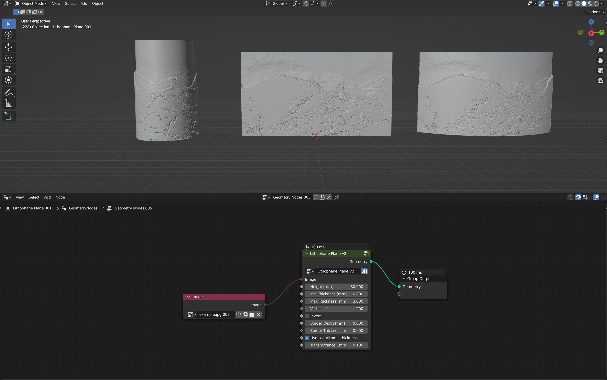
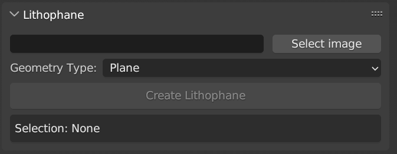
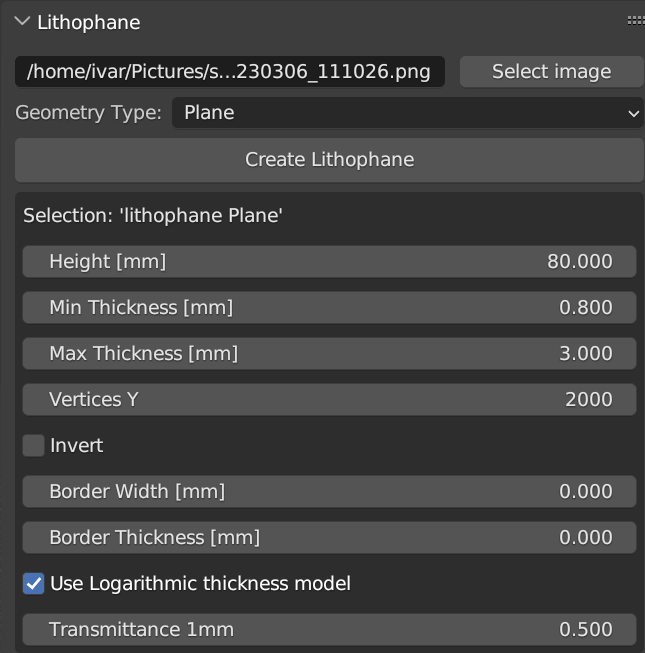

# Blender Lithophane

Blender Lithophane is a simple Blender addon for creating lithophanes from images. Currently, a lithophane 'Plane', 'Arc', or 'Cylinder' can be created.

Note that [Blender 3.5.0](https://builder.blender.org/download/daily/archive/) (currently still in alpha) is required.

## Installation

Download the git repository as a zip file, and install it in Blender from 'Edit&rarr;Preferences&rarr;Add-ons&rarr;Install', and select the zip file (note that there is no need to unzip).

Alternatively, rather than using the blender addon, you could just get the geometry nodes used to create lithophanes from 'lithophanes.blend'.

This addon is written for and tested in Blender 3.5.0 alpha ([Build fe30856d83c7](https://builder.blender.org/download/daily/archive/) December 11, 2022). The addon depends on the 'Image Info' and 'Image Input' geometry nodes that are introduces in Blender 3.5.0, hence previous Blender versions are not supported. Once Blender 3.5.0 goes into beta/release, I will try to make any necessary changes, but please let me know if it no longer works in the most recent Blender version.

## Usage

When the addon is installed, a 'lithophane' panel should be visible in the 3D viewport's side panel as in the image below.

Select an image and lithophane geometry type, and then press the 'Create Lithophane' button. When a lithophane object is selected, relevant properties will show up in the side panel as shown below.

## License

This program is free software; you can redistribute it and/or modify
it under the terms of the GNU General Public License as published by
the Free Software Foundation; either version 3 of the License, or
(at your option) any later version.

This program is distributed in the hope that it will be useful, but
WITHOUT ANY WARRANTY; without even the implied warranty of
MERCHANTIBILITY or FITNESS FOR A PARTICULAR PURPOSE. See the GNU
General Public License for more details.

You should have received a copy of the GNU General Public License
along with this program. If not, see <http://www.gnu.org/licenses/>.
